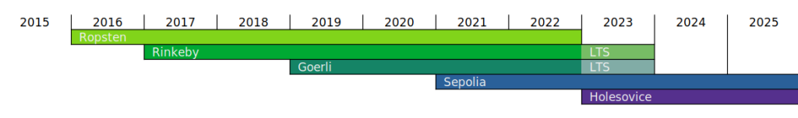

<a href="https://github.com/ethereum/ropsten">Ropsten (2016)</a> | Rinkeby (2017) | <strong>Goerli (2019)</strong> | <a href="https://github.com/eth-clients/sepolia">Sepolia (2021)</a> | <a href="https://github.com/eth-clients/holesky">Holešky (2023)</a>

# Goerli (Goerlitzer Testnet)
The `--goerli` cross-client proof-of-authority testnet configuration.

- Website: https://goerli.net

:warning: Goerli will be **deprecated as of January 2023**. It will be supported long term for the longer of three months after the Dencun upgrade is activated on it, or one month after Dencun is activated on the Ethereum mainnet. No further network upgrade will be deployed to the network after this. Please consider using [Sepolia](https://github.com/eth-clients/sepolia) moving forward.

To learn more about post-merge testnets check out the [Ethereum website](https://ethereum.org/en/developers/docs/networks/) or this [Devcon 6 talk](https://archive.devcon.org/archive/watch/6/post-merge-testnets/?tab=Swarm).

## History

Goerli Testnet was the first proof-of-authority cross-client testnet, synching Geth, Nethermind, Hyperledger Besu, and others. This testnet was a community-based project and completely open-source. It was born in September 2018 during [ETHBerlin](https://ethberlin.com) and has been growing in contributors ever since.

The Goerli testnet was merged with the Prater proof-of-stake beacon chain. This marked the end of the permissioned proof-of-authority phase and everyone is now able to run a validator for Goerli. Therefore, **this repository contains both Goerli execution-layer and Prater consensus-layer configurations**.

## Meta data: Goerli

- Name: **Goerli**
- Flag: `--goerli`
- Stage: _launched_
  - PoA Engine: `clique`
  - Epoch interval: `30000`
  - Step period: `15`
  - Genesis hash: `0xbf7e331f7f7c1dd2e05159666b3bf8bc7a8a3a9eb1d518969eab529dd9b88c1a`
  - Network ID: `5`
  - Chain ID: `5`
- EVM Version: `London`
  - Homestead: `0`
  - Byzantium: `0`
  - Constantinople: `0`
  - Petersfork: `0`
  - Istanbul: `1_561_651`
  - Berlin: `4_460_644`
  - London: `5_062_605`
  - Terminal Total Difficulty: `10790000` (_passed_)
  - Shanghai (timestamp): `1678832736`
  - Cancun (timestamp): `1705473120`
- Status Dashboard:
  - https://stats.goerli.net/
- Block Explorers:
  - https://goerli.etherscan.io/
- Faucets:
  - https://goerlifaucet.com (No auth, or social media account required)
  - https://fauceth.komputing.org/?chain=5 (No social media account required)
  - https://faucet.paradigm.xyz/
  - https://faucet.goerli.mudit.blog/
  - https://faucets.chain.link/goerli (No social media account required)
  - https://goerli-faucet.pk910.de/ (PoW powered, No social media account required)
  - https://faucet.quicknode.com/ethereum/goerli
- Open RPC Endpoints:
  - https://goerli.prylabs.net
  - https://rpc.goerli.mudit.blog
  - https://rpc.slock.it/goerli
  - https://www.ethercluster.com/goerli
  - https://rpc.ankr.com/eth_goerli

## Meta-data: Prater

Prater Testnet (v1.0.1) is the beacon-chain to be merged with the Goerli testnet.

- Minimum genesis Time: `1614588812` (Mar-01-2021 08:53:32 AM +UTC)
- Genesis Delay: `1919188` (`1616508000`, Mar-23-2021 02:00:00 PM +UTC)
- Genesis Fork Version: `0x00001020` (Prater area code, Vienna)
- Fork Digest: `0x79df0428` (`0xe4be9393` pre-genesis fork digest)
- Initial State Root: `0x895390e92edc03df7096e9f51e51896e8dbe6e7e838180dadbfd869fdd77a659`
- Genesis Block Root:
	- Without state root update: `0xeade62f0457b2fdf48e7d3fc4b60736688286be7c7a3ac4c9a16a5e0600bd9e4`
	- With state root update: `0x8c0ebce425ca04612f8a4c9b3d9b339121a62a8fe2baf8ff2c6f77b81194ee87`
- Genesis Validators Root: `0x043db0d9a83813551ee2f33450d23797757d430911a9320530ad8a0eabc43efb`
- Deposit Contract: `0xff50ed3d0ec03aC01D4C79aAd74928BFF48a7b2b` (Goerli Testnet)
	- Mainnet: [`DoNotSendFundsHere`](https://etherscan.io/address/0xff50ed3d0ec03ac01d4c79aad74928bff48a7b2b#code)
	- Goerli: [`DepositContract`](https://goerli.etherscan.io/address/0xff50ed3d0ec03ac01d4c79aad74928bff48a7b2b#code)
- Deposit Contract Block: `4367322` (`0x5ac670562dbf877a45039d65ec3c2e3402a40eda9b1dba931c2376ab7d0927c2`)

## Contribute

Run a node and [report bugs](https://github.com/goerli/testnet/issues)!
